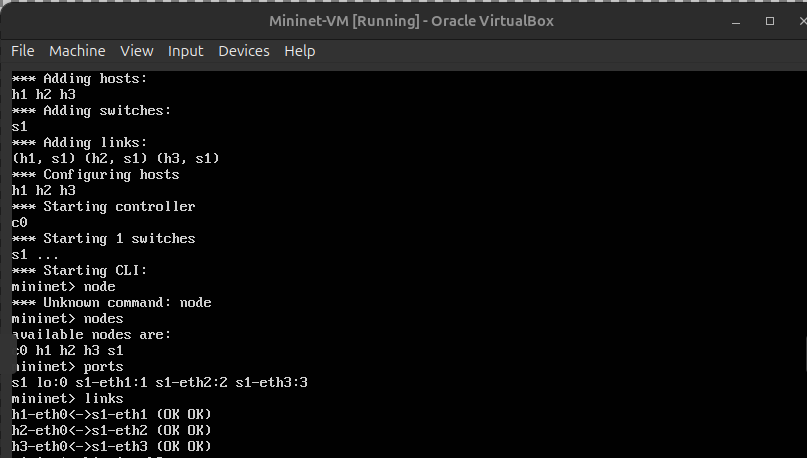
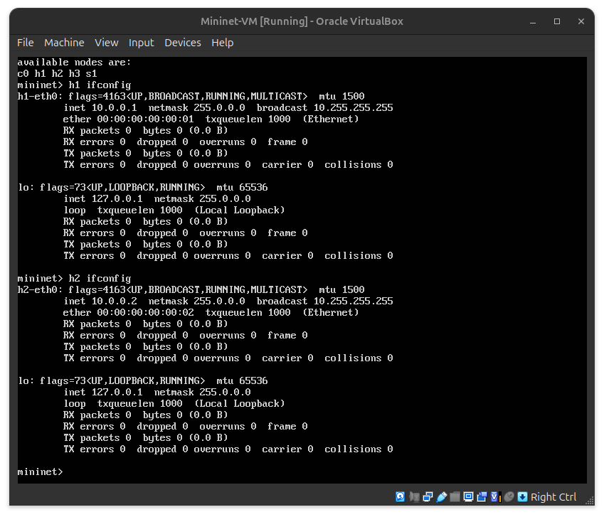
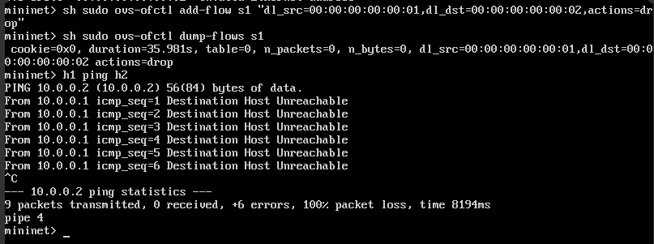
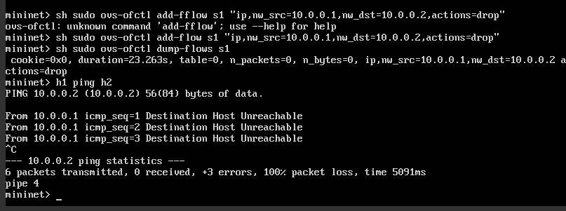

# Laboratório de Redes SDN com Mininet

<p align="center">
    Aluno: Bruno Daigo Yamamoto
</p>

## Introdução

Este documento descreve os passos realizados no laboratório de redes utilizando o Mininet e o controlador Ryu. O objetivo principal foi aplicar filtros de Camada 2, 3 e 4 para bloquear pacotes entre hosts em uma topologia de rede simples.

O ambiente utilizado consiste no Mininet rodanndo em uma VM, controlador Ryu para gerenciar os switches OpenFlow, e ferramentas como o `ovs-ofctl` para gerenciaros fluxos dos switchees e `curl`para testar a conectividade com servidores web.

## Topologia de Rede

A topologia de rede configurada no Miniset consistiu em:
- Um switch (s1)
- Tres hosts (h1, h2, h3)
- Controlador Ryu 

### Comando para iniciar a topologia:
``` bash
  sudo mn --topo single,3 --mac --controller=remote --switch ovsk --protocols=OpenFlow13
```



## Filtro de camada 2

Neste passo, foi aplicada uma regra de filtro baseada nos endereços MAC dos hosts. A regra configurada bloqueou pacotes enviados de h1 para h2.

### Obtenção dos endereços MAC:



### Aplicacao da regra de filtro
```bash
    sh sudo ovs-ofctl add-flow s1 "dl_src=00:00:00:00:00:01,dl_dst=00:00:00:00:00:02,actions=drop"
```

### Teste de conectividade

O ping entre h1 e h2 foi testado novamente, e a comunicação foi bloqueada.



Na figura podemos observar a tabela de fluxos do switch s1.

## Filtro de camada 3

A regra de Camada 3 bloqueou pacotes com base nos endereços IP dos hosts.

### Obtenção dos endereços IP:


### Aplicacao da regra de filtro
```bash
    sh sudo ovs-ofctl add-flow s1 "ip,nw_src=10.0.0.1,nw_dst=10.0.0.2,actions=drop"

```

### Teste de conectividade

O ping entre h1 e h2 foi testado novamente, e a comunicação foi bloqueada.



## Filtro de camada 4

Foi configurado um servidor web no host h3 e uma regra para bloquear pacotes baseados em portas TCP (porta 80).

### Iniciar o servidor web no h3
```bash
    h3 python2 -m SimpleHTTPServer 80 &

```

### Aplicação do filtro 
```bash
    sh sudo ovs-ofctl add-flow s1 "tcp,tp_dst=80,actions=drop"

```

### Teste de conectividade
```bash
  h1 curl h3
  h2 curl h3
```

Tive dificuldades na instalação do curl na máquina virtual, entao cnao consegui realizar esse teste.

